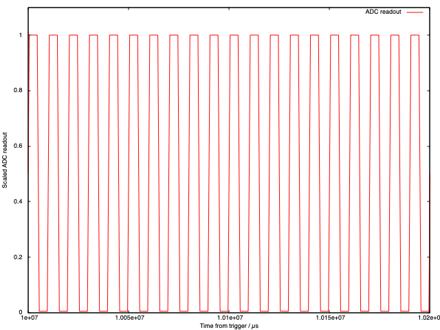
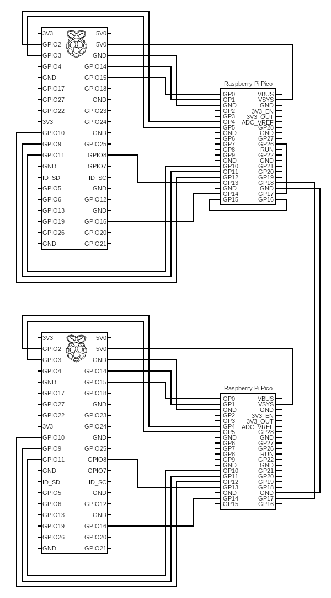
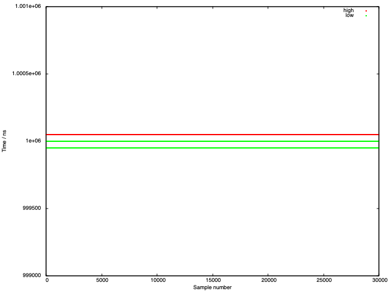

# Picoscope / Picounter

The `picoscope` and `picounter` share a common ancestor - a basic implementation of the high speed IRQ powered ADC reader. That one showed some timing weirdness (ADC reading in IRQ is jittery) so the `picounter` was born to count "PIO clock ticks" for pulses being high and low.

This can be used to verify that the current implementation is reasonably solid.

`picoscope` output looks like:

Wiring up a second pico / π combination as follows:

Allows the bug pin (which is toggled in each IRQ call) to be used to measure the cycle time jitter. As can be seen from

there is in fact very little - the shortest time the current counter is set up to read is 5 ticks, which is 50ns with the default clock divider of 1.25: so the jitter is one "count" i.e. about as good as it gets.