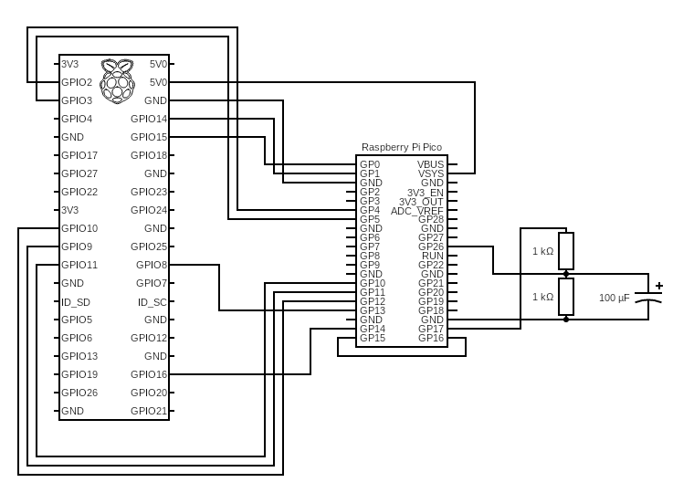
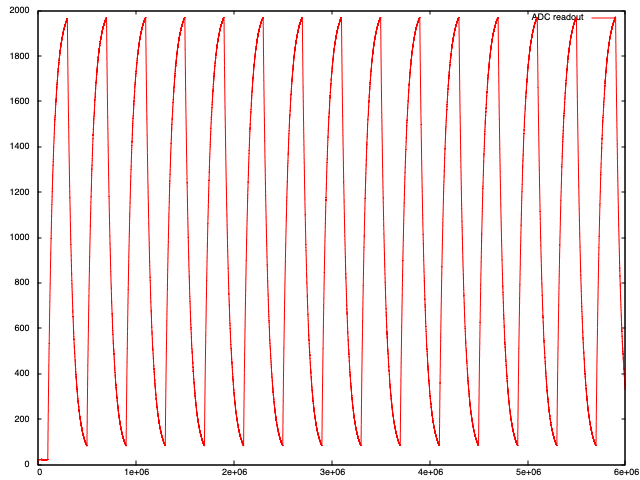

Picoscope - The £4 toy oscilloscope
===================================

The Raspberry Pi pico is the first microcontroller from the Raspberry Pi foundation - and it is often presented as a way of running micropython to drive motors or blink LEDs (or drive sensors etc...) but in fact it is a moderately powerful device in its own right. The two ARM Cortex-M0+ cores attract the attention but the real power comes from multiple PIO devices, DMA, a substantial amount of RAM, ADC etc. - sufficient that you can use this as a peripheral device to attach to a Raspberry Pi computer for (modest) real-time data capture. Hence, the picoscope.

The picoscope answers the question of reading ADC data at a reliable clock (e.g. 100µs) with perhaps synchronised driving of a circuit, saving the data to internal arrays. The tooling includes:

 - a driver circuit - allownig square wave with a set delay, high, low sequence
 - a trigger circuit for the readout
 - i2c control for set-up / arming
 - 3.3v trigger over GPIO
 - data egress via spi

The simplest application is to monitor the voltage across an RC circuit, driven by the driver clock then reading the voltage across the capacitor.



The Python code running on the Raspberry Pi then looks like:

```python
from picoscope import Picoscope

pico = Picoscope()
pico.probe(0, 50, 50, 60000)
pico.drive(0, 100000, 100000, 0)
pico.arm()
pico.trigger()
pico.wait()
data = pico.read()
time = pico.time()

for t, d in zip(time, data):
    print(t, d)
```

This outputs the following when connected to an RC consisting of 2 x 1k resistors, 100µF capacitor:


