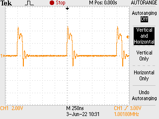
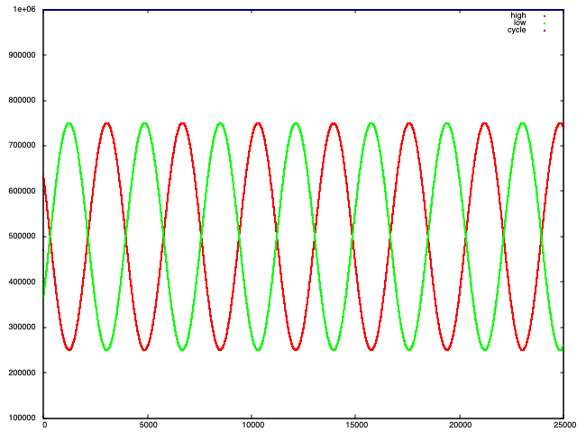

# Frequency Counter
Basic example of the species: reads for 25,000 pulses and then prints the time
spent in high, low. Clocks PIO at 100 MHz (divider 1.25) and takes 5 cycles to
read - seems to work OK for 100ns pulses:



Though not sure how reliable will be below this.

## Example
Hook up second pico running MicroPython as a pulse generator, hooking up a PWM to a GPIO pin such as:

```python
from machine import Pin, PWM, RTC
from time import sleep, time

pwm = PWM(Pin(17))

for j in range(100):
    for duty in range(0, 0xff00, 2):
        pwm.duty_u16(duty)
    for duty in range(0xff00, 0, -2):
        pwm.duty_u16(duty)
```

This will generate PWM pulses on (it would seem) a default frequency of 1 kHz, with duty cycle from 0 to nearly 100%. Hooking up the timer and saving the high and low times from this (sampling from the middle of a "run") gives the following output:


